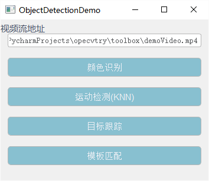
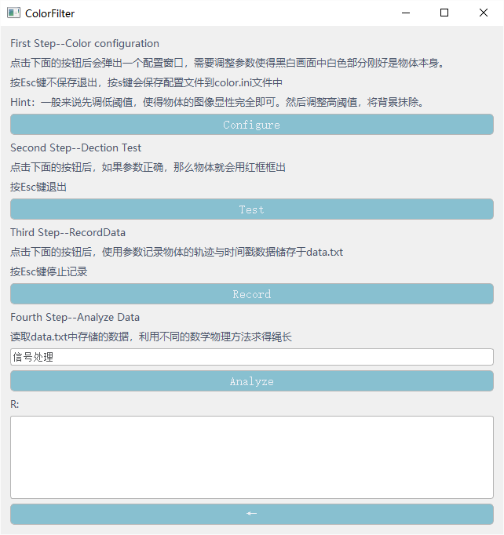

# Motivation
本项目来源于2021年电赛D题，原题要求使用双摄像头识别一单摆的摆长和在地面系上的摆动偏角（详细可百度）。基于比赛时期的代码，本程序基于opencv-python实现了目前主流的一些图像识别算法，并以单摄像头识别单摆摆场为demo。基于本项目可以实现简单的物体识别项目的二次开发，或者直接利用demo程序作为数据生成工具。
# 原理
第一步是要把图像中的单摆过滤出来

第二步将过滤出来的本体的中心与当前的时间戳一起记录下来

第三步根据记录下来的每一时刻的单摆位置计算单摆的摆动周期，利用物理单摆公式求得摆长。或者利用摆动轨迹拟合出摆动方程，直接从数学上得到摆长。
# Install
首先就是克隆下来啦
```bash
git clone https://github.com/arnoliudaxia/ObjectDectionFramework.git
```
不管使用什么python环境，确保python版本在3.4以上，环境要求是numpy,opencv3,matplotlib,scipy,pyQt5

所有功能都已经集成在ui.py中，运行demo只需要
```bash
python ui.py
```
# Doc
运行demo后主界面如下



其中“视频流地址”文本框指的是视频流的地址或者视频的文件路径
- 视频最好是mp4格式使用H.264协议。其他均未测试，理论上opencv支持的视频格式都支持
- 我对视频流协议不太了解，实测一般的推流协议都支持
---
对于每一种视觉识别算法，鼠标停留在控件上都有解释


点击即会跳转到一个新的窗口，进入到使用该算法完成计算摆场的流程



每一步都有比较详细的解释，基本流程就是先调整好过滤器的参数，然后记录数据，最后分析数据。
#build
我尝试了pyinstaller和nuitka，试了好久好久，都失败了。环境包太多，依赖关系太过于复杂，打包程序运行时还对包的版本有自己的要求。我实在整不动了。
# 参考资料、文献
累计起来已经有几百条了，不列了
#开源许可申明
代码部分借鉴自官方文档，本项目开源协议为MIT