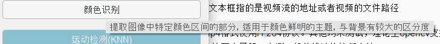

# Motivation
本项目来源于2021年电赛D题，原题要求使用双摄像头识别一单摆的摆长和在地面系上的摆动偏角（详细可百度）。基于比赛时期的代码，本程序基于opencv-python实现了目前主流的一些图像识别算法，并以单摄像头识别单摆摆场为demo。基于本项目可以实现简单的物体识别项目的二次开发，或者直接利用demo程序作为数据生成工具。
# 原理
第一步是要把图像中的单摆过滤出来

第二步将过滤出来的本体的中心与当前的时间戳一起记录下来

第三步根据记录下来的每一时刻的单摆位置计算单摆的摆动周期，利用物理单摆公式求得摆长。或者利用摆动轨迹拟合出摆动方程，直接从数学上得到摆长。
# Install
首先就是克隆下来啦
```bash
git clone https://github.com/arnoliudaxia/ObjectDectionFramework.git
```
不管使用什么python环境，确保python版本在3.4以上，环境要求是numpy,opencv3,matplotlib,scipy,pyQt5

所有功能都已经集成在ui.py中，运行demo只需要
```bash
python ui.py
```
# Doc
运行demo后主界面如下


其中“视频流地址”文本框指的是视频流的地址或者视频的文件路径
- 视频最好是mp4格式使用H.264协议。其他均未测试，理论上opencv支持的视频格式都支持
- 我对视频流协议不太了解，实测一般的推流协议都支持
---
对于每一种视觉识别算法，鼠标停留在控件上都有解释



点击即会跳转到一个新的窗口，进入到使用该算法完成计算摆场的流程


每一步都有比较详细的解释，基本流程就是先调整好过滤器的参数，然后记录数据，最后分析数据。

# 演示
https://www.bilibili.com/video/BV1au41117rX/
<iframe src="//player.bilibili.com/player.html?aid=508396244&bvid=BV1au41117rX&cid=493190533&page=1" scrolling="no" border="0" frameborder="no" framespacing="0" allowfullscreen="true"> </iframe>

# build
我尝试了pyinstaller和nuitka，试了好久好久，都失败了。环境包太多，依赖关系太过于复杂，打包程序运行时还对包的版本有自己的要求。我实在整不动了。

# 目录结构

```
├─Calculate #处理数据的代码
│  │  mathFitCircle.py #使用离散轨迹拟合摆动圆
│  │  SignalProcess.py #使用信号处理方法拟合信号周期
│
├─docs # README中的图片
│      img.png
│      img2.png
│      img3.png
│
├─ref #一些个人参考代码，demo不依赖于这些，可以删除
│  │  drawconvexhull.py
│  │  opencvReadVideo.py
│  │  videoLightMotion.py
│  │
│  └─socket
│          socketClient.py
│          socketServer.py
│
├─stylesheets #demo程序控件CSS样式表
│  │  flatwhite.css
│  │  lightblue.css
│  │  psblack.css
│  │
│  ├─flatwhite
│  │      ...
│  ├─lightblue
│  │      ...
│  └─psblack
│  │      ...
├─toolbox #该文件夹下是demo的后端框架
│  │  demoVideo.mp4 #示例程序
│  │  mathUtility.py #包含了一些用到的数学和物理函数
│  │  opencvFramework.py #核心代码，几乎抽象了一个软openmv
│  │  setting.py #设置系统接口
│  │
│  ├─ini #包含了配置文件，记录各种参数数值
│  │      camera.ini #摄像头相关配置
│  │      color.ini #颜色滤镜相关配置
│  │      motion.ini #光流法相关配置
│  ColorCailbrate.py #基于色彩空间的滤波器
│  data.txt #单摆数据
│  findPen.py #使用滤波器过滤物体的执行器
│  MotionCailbrate.py #调试光流法参数
│  obj.jpg #用于模板匹配的物体图像
│  README.md
│  recordData.py #记录物体位置数据的执行器
│  style.qss #CSS样式表
│  ui.py #GUI
│
└──────────────────────────────────

```

# 参考资料、文献
累计起来已经有几百条了，不列了

# 开源许可申明
代码部分借鉴自官方文档，本项目开源协议为MIT
